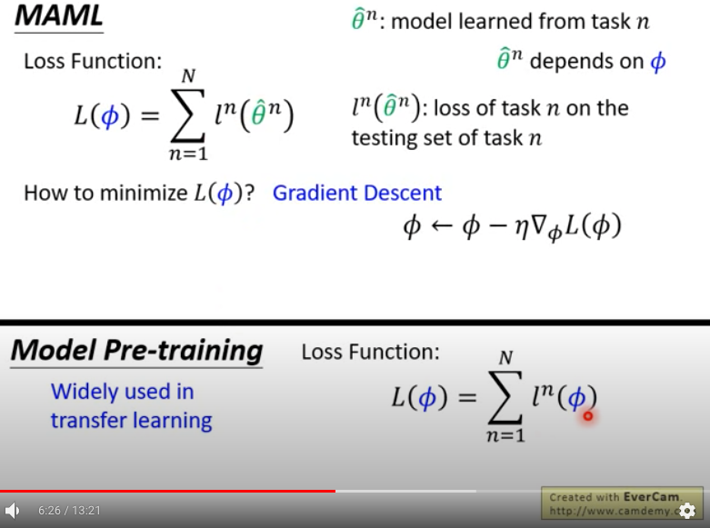
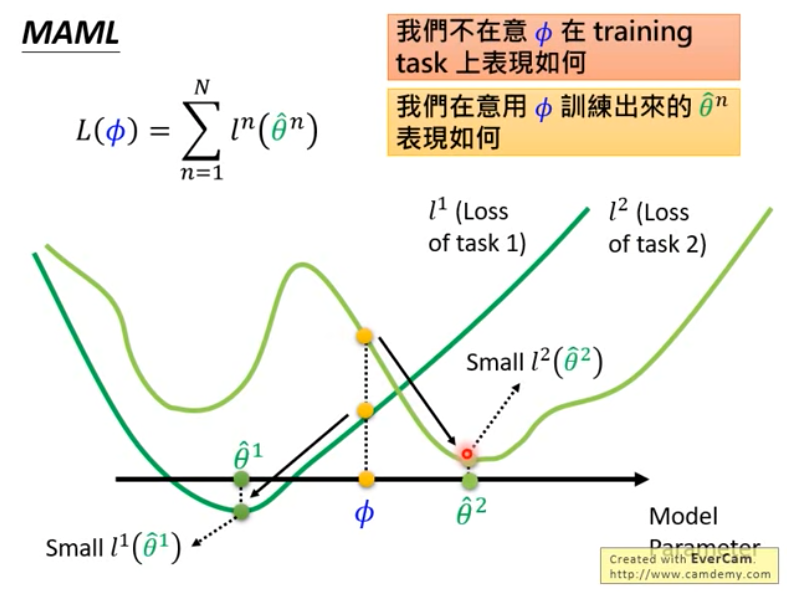
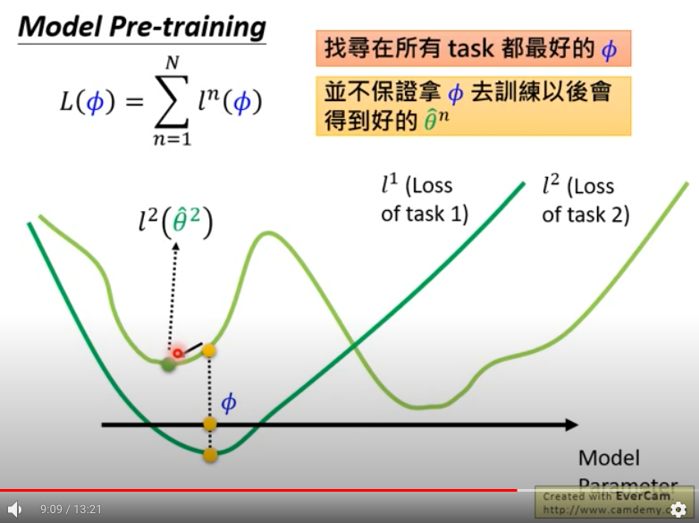
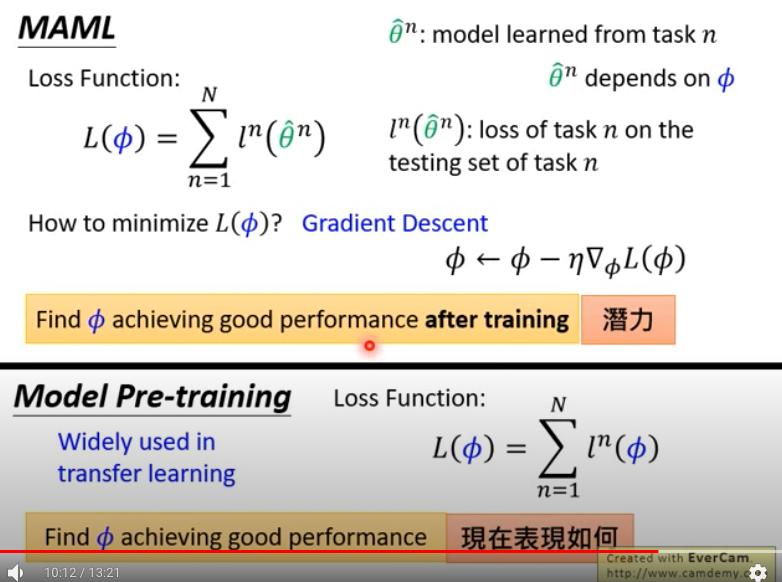

# MAML

跟 model 無關的，不會受 model 限制的方法。

目標在學一個最好的 initialization parameter。

對所有的 task, 固定相同的模型架構，固定相同的一組初始化參數 phi。

針對每一個 task n, 都有一套模型參數 theta_n, 而這個模型參數會跟初始化參數 phi 有關係。
拿 theta_n 作在 quary set 上面，得到的 loss 叫做 l_n，則把所有 task 的 l_n 加起來，得到 L，就是 MAML 的 loss。

我們要利用這個 loss 來更新 phi, 找到一組最好的初始化參數。那麼該如何 minimize L 呢？ 就是硬做 gradient descent，也就是算出 phi 對 L 的 gradient ，再以此對 phi 做更新。

## MAML v.s Model pre-training
在做 transfer learning 時很常使用 pre-training 。 source data 很大， target data 很少，我們就會把 model training 在 source data 上，再 fine-tuning 在 target data 上。

他和 MAML 的最大差異在於拿來算 loss 的參數不一樣：

  

* pre-training: 拿當下的模型參數對 pre-training 的test data 算 loss。
* MAML: 拿經過訓練後的模型參數對 test data 算 loss。

### MAML: 找一個好的初始參數
假設 model 是一維的，兩條不同顏色的線代表兩個不同的 task loss：

我們不在意 phi 在 task 上的表現（也就是 loss）如何，而是用 phi 訓練出來的模型參數 theta 表現如何。

phi 本身可能表現不怎麼好，但他可以是一個好的初始化參數，因為從 phi 出發，可以很順利的找到好的參數。（ theta_1, theta_2 )

### Pre-training: 找一個好的參數
尋找在所有 task 中都最好的參數。但真正拿去 fine-tuning 時，不一定保證可以找到最好的參數（可能只能找到 local min: theta_2)

用畢業要做什麼為例子:
* 現在去工作 -> 立刻得到很多錢 -> model pre-training
* 簽博 -> 有潛力，念完博班之後人生道路更寬廣 -> MAML
 

## MAML 實作
1. training 時參數只會被 update 1 次，就當作最終訓練結果(theta)。因為：
    * 只是要看潛力而已
    * few-shot learning 的 data 量很少, 所以update 太多次會 overfitting。
2. 實際上在 testing 時可以 update 多次，得到較好的結果。

# ANIL [3]
ANIL 是 MAML 的 following work.
1. 在 inner loop 只留下 task-specific head.
2. 可以更有效率的做 training, 並且和 MAML 一樣好。

假如我們將一個 prediction model 拆成兩部分： feature extractor 和 predictor， predictor 就是最後一層的 head。
在原本的 MAML， inner loop 中， feature extractor 跟 head 都會一起更新，而在 ANIL 則是只會更新 head, 而把 feature extractor 固定住。

可想而知，ANIL 一定會比較有效率，因為需要更新的參數少很多。令人驚訝的是，這樣做可以跟原本的 MAML 一樣好。

# FOMAML [4]

## Reference
[1] [Hung-yi Lee 2019 Meta learning - MAML (1/9 - 9/9)](https://youtu.be/EkAqYbpCYAc)

[2] [Paper repro: Deep Metalearning using “MAML” and “Reptile”](https://towardsdatascience.com/paper-repro-deep-metalearning-using-maml-and-reptile-fd1df1cc81b0)

[3] [learn2learn Feature Reuse with ANIL](http://learn2learn.net/tutorials/anil_tutorial/ANIL_tutorial/)

[4]FOMAML Hung-yi Lee 2019:   
    * [Slides](http://speech.ee.ntu.edu.tw/~tlkagk/courses/ML_2019/Lecture/Meta1%20(v6).pdf#page=24)  
    * [Video](https://www.youtube.com/watch?v=mxqzGwP_Qys&list=PLJV_el3uVTsOK_ZK5L0Iv_EQoL1JefRL4&index=39)
### 作業 resource
* 作業 slides: https://speech.ee.ntu.edu.tw/~hylee/ml/ml2021-course-data/hw/HW15/HW15.pdf 
